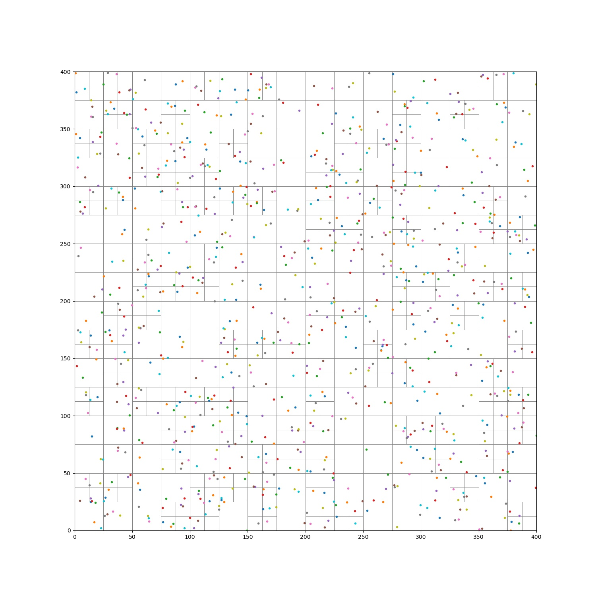

# quadtree-py
  
> Quadtree is an essential data structure in the realm of GIS (Geographic Information System) which is able to build spatial
> index, perform spatial analysis, and compress data.

The visualization of quadtree is displayed as following:

## Usage
```python
from quadtree import QuadTree, Bounds, Point
import random

if __name__ == '__main__':
    my_tree = QuadTree(Bounds(0, 0, 400, 400), max_objects=4, max_level=5)
    for i in range(1000):
        x = random.random() * 400
        y = random.random() * 400
        point = Point(x, y)
        my_tree.insert(point)
    my_tree.insert(Point(15, 325))
    my_tree.visualize()
```
## TODO
- [ ] nearest neighbors
- [ ] spatial analysis
